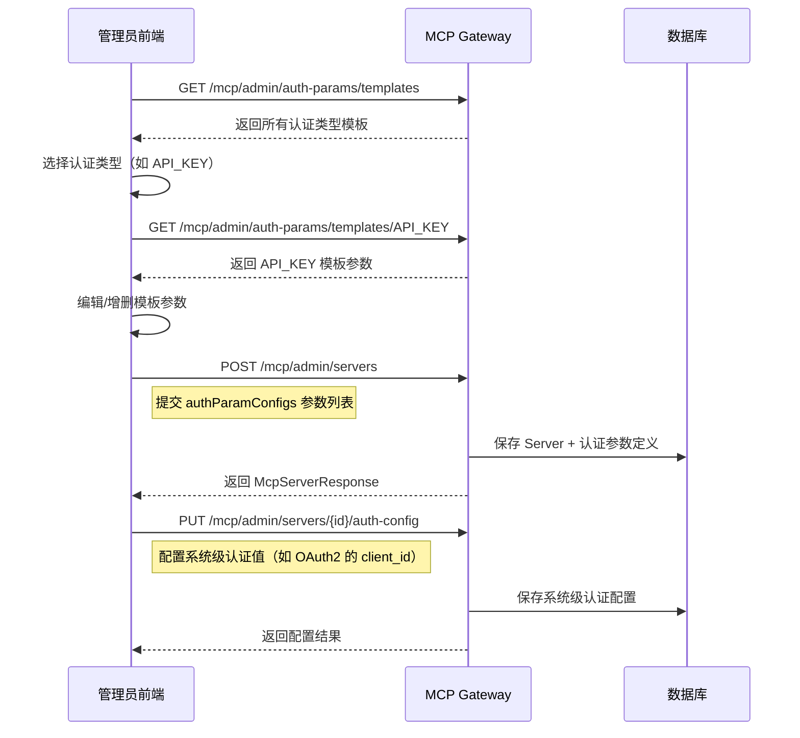
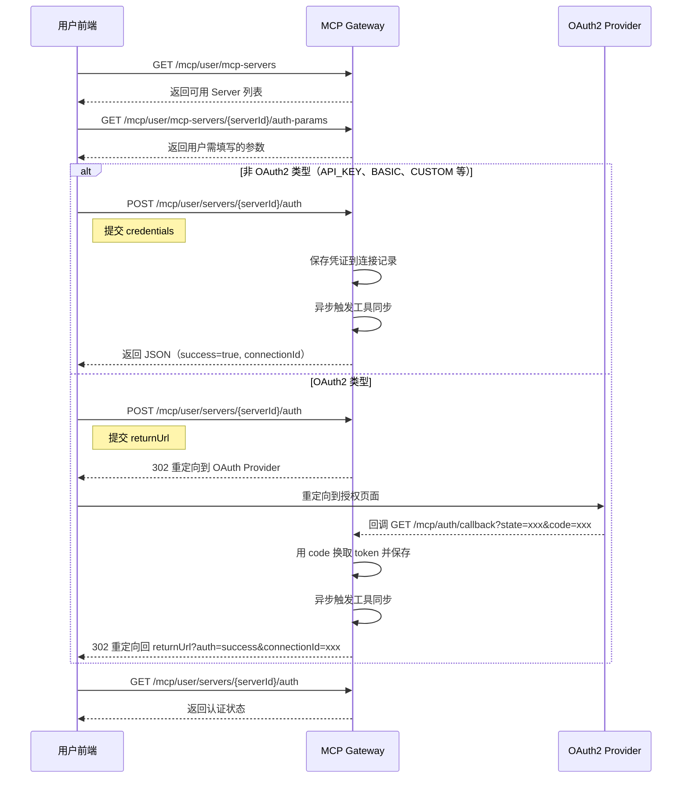
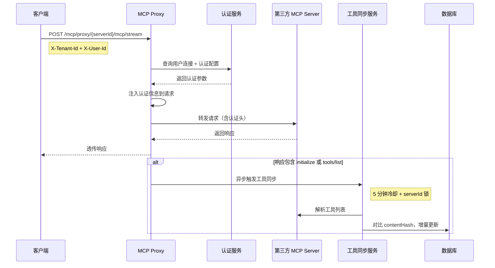
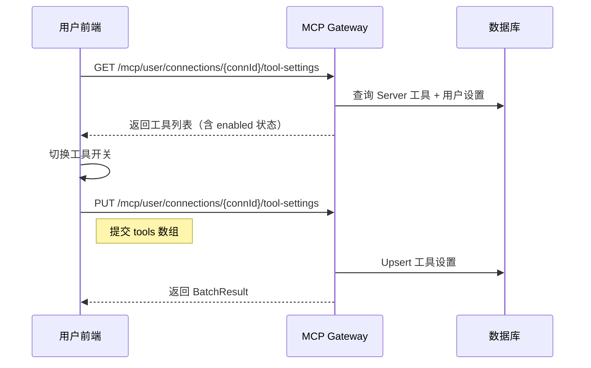

# MCP Gateway API 接口文档

> 本文档涵盖 `abc-mcp-gateway` 所有对外接口，供前端对接使用。

---

## 目录

- [全局约定](#全局约定)
- [枚举值定义](#枚举值定义)
- [模块一：MCP Server 管理（管理端）](#模块一mcp-server-管理管理端)
- [模块二：认证参数与模板管理（管理端）](#模块二认证参数与模板管理管理端)
- [模块三：分类管理（管理端）](#模块三分类管理管理端)
- [模块四：MCP Server 目录（用户端）](#模块四mcp-server-目录用户端)
- [模块五：用户连接管理](#模块五用户连接管理)
- [模块六：统一认证](#模块六统一认证)
- [模块七：OAuth2 认证](#模块七oauth2-认证)
- [模块八：MCP 代理](#模块八mcp-代理)
- [模块九：工具管理](#模块九工具管理)
- [数据模型（DTO Schema）](#数据模型dto-schema)
- [关键业务流程](#关键业务流程)

---

## 全局约定

### Base URL

```
http://{host}:{port}
```

### 统一响应格式 `Result<T>`

所有接口均返回以下 JSON 结构：

```json
{
  "code": 0,
  "message": null,
  "data": { ... },
  "requestId": "req_abc123"
}
```

| 字段 | 类型 | 说明 |
|------|------|------|
| `code` | `int` | 业务状态码，`0` 表示成功，非零表示错误 |
| `message` | `string \| null` | 错误信息，成功时为 `null`（不返回该字段） |
| `data` | `T \| null` | 响应数据 |
| `requestId` | `string \| null` | 请求追踪 ID |

### 公共请求头

| Header | 类型 | 必填 | 默认值 | 说明 |
|--------|------|------|--------|------|
| `X-Tenant-Id` | `string` | 否 | `system` | 租户 ID |
| `X-User-Id` | `string` | 否 | `anonymous` | 用户 ID（用户端接口需要） |
| `Content-Type` | `string` | 是 | - | POST/PUT 请求需设置为 `application/json` |

### 分页约定

分页接口使用 Spring Data 标准分页参数：

| 参数 | 类型 | 默认值 | 说明 |
|------|------|--------|------|
| `page` | `int` | `0` | 页码，从 0 开始 |
| `size` | `int` | `10` | 每页数量 |
| `sort` | `string` | `createdAt,desc` | 排序字段和方向 |

分页响应格式：

```json
{
  "code": 0,
  "data": {
    "content": [ ... ],
    "totalElements": 100,
    "totalPages": 10,
    "number": 0,
    "size": 10,
    "first": true,
    "last": false
  }
}
```

---

## 枚举值定义

### McpServerAuthType — 认证类型

| 值 | 说明 |
|----|------|
| `NONE` | 无认证 |
| `API_KEY` | API Key 认证 |
| `BASIC` | Basic 认证（用户名/密码） |
| `OAUTH2` | OAuth2 认证 |
| `BEARER_TOKEN` | Bearer Token 认证 |
| `CUSTOM` | 自定义认证 |

### McpServerStatus — 服务器状态

| 值 | 说明 |
|----|------|
| `ACTIVE` | 启用 |
| `DISABLED` | 禁用 |

### RuntimeMode — 运行模式

| 值 | 说明 |
|----|------|
| `LOCAL` | 本地运行 |
| `REMOTE` | 远程运行 |

### ParamType — 参数类型

| 值 | 说明 |
|----|------|
| `STRING` | 字符串 |
| `NUMBER` | 数字 |
| `BOOLEAN` | 布尔值 |
| `SECRET` | 敏感值（前端应使用密码输入框） |

### ParamLocation — 参数位置

| 值 | 说明 |
|----|------|
| `HEADER` | HTTP 请求头 |
| `QUERY` | URL 查询参数 |
| `BODY` | 请求体 |
| `COOKIE` | Cookie |

### LevelScope — 参数级别

| 值 | 说明 |
|----|------|
| `SYSTEM` | 系统级（管理员配置，所有用户共享） |
| `USER` | 用户级（每个用户独立配置） |

---

## 模块一：MCP Server 管理（管理端）

> **Base Path:** `/mcp/admin/servers`
>
> 管理员对 MCP Server 的 CRUD 操作、工具同步、认证配置管理。

### 1.1 创建 MCP Server

```
POST /mcp/admin/servers
```

**请求头：**

| Header | 必填 | 说明 |
|--------|------|------|
| `X-Tenant-Id` | 否 | 租户 ID，默认 `system` |

**请求体：** [`McpServerCreateRequest`](#mcpservercreaterequest)

```json
{
  "serverCode": "hr_management_server",
  "name": "HR Management Server",
  "description": "Comprehensive HR management tools",
  "endpoint": "https://api.example.com/mcp",
  "authType": "API_KEY",
  "supportsStreaming": true,
  "runtimeMode": "REMOTE",
  "icon": "https://example.com/icon.png",
  "categories": "[\"development\",\"integration\"]",
  "authParamConfigs": [
    {
      "paramKey": "api_key",
      "paramName": "API Key",
      "paramType": "SECRET",
      "location": "HEADER",
      "locationName": "Authorization",
      "levelScope": "USER",
      "isRequired": true,
      "defaultValue": "",
      "description": "Your API key",
      "exampleValue": "sk-xxxx",
      "sortOrder": 1
    }
  ]
}
```

**响应：** `Result<McpServerResponse>` — HTTP 201

```json
{
  "code": 0,
  "data": {
    "id": "srv-uuid-001",
    "serverCode": "hr_management_server",
    "name": "HR Management Server",
    "description": "Comprehensive HR management tools",
    "endpoint": "https://api.example.com/mcp",
    "authType": "API_KEY",
    "supportsStreaming": true,
    "runtimeMode": "REMOTE",
    "icon": "https://example.com/icon.png",
    "status": "ACTIVE",
    "toolCount": 0,
    "tools": [],
    "categories": ["development", "integration"],
    "authParamConfigs": [ ... ],
    "tenantId": "system",
    "createdAt": "2025-01-01T00:00:00Z",
    "updatedAt": "2025-01-01T00:00:00Z"
  }
}
```

---

### 1.2 更新 MCP Server

```
PUT /mcp/admin/servers/{serverId}
```

**路径参数：**

| 参数 | 类型 | 说明 |
|------|------|------|
| `serverId` | `string` | Server ID |

**请求体：** [`McpServerUpdateRequest`](#mcpserverupdaterequest)

```json
{
  "name": "Updated Server Name",
  "description": "Updated description",
  "endpoint": "https://api.example.com/mcp/v2",
  "authType": "OAUTH2",
  "supportsStreaming": true,
  "runtimeMode": "REMOTE",
  "icon": "https://example.com/icon-v2.png",
  "status": "ACTIVE",
  "categories": "[\"ai-tools\"]"
}
```

**响应：** `Result<McpServerResponse>`

---

### 1.3 删除 MCP Server

```
DELETE /mcp/admin/servers/{serverId}
```

**路径参数：**

| 参数 | 类型 | 说明 |
|------|------|------|
| `serverId` | `string` | Server ID |

**响应：** `Result<Void>` — HTTP 204

```json
{
  "code": 0,
  "data": null
}
```

---

### 1.4 获取单个 MCP Server

```
GET /mcp/admin/servers/{serverId}
```

**路径参数：**

| 参数 | 类型 | 说明 |
|------|------|------|
| `serverId` | `string` | Server ID |

**响应：** `Result<McpServerResponse>`

---

### 1.5 分页查询 MCP Server

```
GET /mcp/admin/servers
```

**查询参数：**

| 参数 | 类型 | 必填 | 说明 |
|------|------|------|------|
| `runtimeMode` | `string` | 否 | 运行模式过滤：`REMOTE` / `LOCAL` |
| `name` | `string` | 否 | 名称模糊搜索 |
| `status` | `string` | 否 | 状态过滤：`ACTIVE` / `DISABLED` |
| `categoryCode` | `string` | 否 | 分类 code 过滤 |
| `page` | `int` | 否 | 页码，默认 0 |
| `size` | `int` | 否 | 每页数量，默认 10 |
| `sort` | `string` | 否 | 排序，默认 `createdAt,desc` |

**响应：** `Result<Page<McpServerResponse>>`

```json
{
  "code": 0,
  "data": {
    "content": [
      {
        "id": "srv-001",
        "name": "Jira",
        "authType": "CUSTOM",
        "status": "ACTIVE",
        ...
      }
    ],
    "totalElements": 28,
    "totalPages": 3,
    "number": 0,
    "size": 10
  }
}
```

---

### 1.6 检查 Server 名称是否存在

```
GET /mcp/admin/servers/check-name
```

**查询参数：**

| 参数 | 类型 | 必填 | 说明 |
|------|------|------|------|
| `name` | `string` | 是 | 要检查的名称 |

**响应：** `Result<Boolean>`

```json
{
  "code": 0,
  "data": false
}
```

---

### 1.7 同步 Server 工具

```
POST /mcp/admin/servers/{serverId}/sync
```

从远程 MCP Server 拉取并更新工具列表。

**路径参数：**

| 参数 | 类型 | 说明 |
|------|------|------|
| `serverId` | `string` | Server ID |

**响应：** `Result<List<McpToolResponse>>`

```json
{
  "code": 0,
  "data": [
    {
      "id": "tool-001",
      "name": "jira_list_projects",
      "description": "List all Jira projects",
      "parameters": "{\"type\":\"object\",\"properties\":{...}}",
      "enabled": null
    }
  ]
}
```

---

### 1.8 获取 Server 系统级认证配置

```
GET /mcp/admin/servers/{serverId}/auth-config
```

**响应：** `Result<McpServerAuthConfigResponse>`

```json
{
  "code": 0,
  "data": {
    "serverId": "srv-001",
    "configValues": {
      "client_id": "xxx",
      "client_secret": "***"
    },
    "updatedAt": "2025-01-01T12:00:00Z"
  }
}
```

---

### 1.9 保存 Server 系统级认证配置

```
PUT /mcp/admin/servers/{serverId}/auth-config
```

**请求体：** [`McpServerAuthConfigRequest`](#mcpserverauthconfigrequest)

```json
{
  "configValues": {
    "client_id": "my-client-id",
    "client_secret": "my-secret"
  }
}
```

**响应：** `Result<McpServerAuthConfigResponse>`

---

### 1.10 删除 Server 系统级认证配置

```
DELETE /mcp/admin/servers/{serverId}/auth-config
```

**响应：** `Result<Void>` — HTTP 204

---

## 模块二：认证参数与模板管理（管理端）

> **Base Path:** `/mcp/admin`
>
> 管理认证参数定义和认证类型模板。

### 2.1 获取 Server 认证参数定义

```
GET /mcp/admin/servers/{serverId}/auth-params
```

获取指定 Server 的所有认证参数定义。

**响应：** `Result<List<AuthParamConfigResponse>>`

```json
{
  "code": 0,
  "data": [
    {
      "id": "param-001",
      "serverId": "srv-001",
      "paramKey": "api_key",
      "paramName": "API Key",
      "paramType": "SECRET",
      "location": "HEADER",
      "locationName": "Authorization",
      "levelScope": "USER",
      "isRequired": true,
      "defaultValue": "",
      "validationRule": null,
      "description": "Your API key",
      "exampleValue": "sk-xxxx",
      "sortOrder": 1,
      "createdAt": "2025-01-01T00:00:00Z",
      "updatedAt": "2025-01-01T00:00:00Z"
    }
  ]
}
```

---

### 2.2 保存 Server 认证参数定义

```
PUT /mcp/admin/servers/{serverId}/auth-params
```

**请求体：** `List<AuthParamConfigRequest>`

```json
[
  {
    "paramKey": "api_key",
    "paramName": "API Key",
    "paramType": "SECRET",
    "location": "HEADER",
    "locationName": "Authorization",
    "levelScope": "USER",
    "isRequired": true,
    "defaultValue": "",
    "description": "Your API key",
    "exampleValue": "sk-xxxx",
    "sortOrder": 1
  }
]
```

**响应：** `Result<List<AuthParamConfigResponse>>`

---

### 2.3 获取单个认证类型模板

```
GET /mcp/admin/auth-params/templates/{authType}
```

根据认证类型获取预定义的参数模板。前端在用户选择认证类型时调用此接口，获取预填参数列表。

**路径参数：**

| 参数 | 类型 | 说明 |
|------|------|------|
| `authType` | `string` | 认证类型：`NONE`, `API_KEY`, `BASIC`, `OAUTH2`, `BEARER_TOKEN` |

**响应：** `Result<AuthConfigTemplateResponse>`

```json
{
  "code": 0,
  "data": {
    "authType": "API_KEY",
    "authTypeName": "API Key Authentication",
    "description": "Authenticate using an API key in the request header",
    "paramTemplates": [
      {
        "paramKey": "api_key",
        "paramName": "API Key",
        "paramType": "SECRET",
        "location": "HEADER",
        "locationName": "Authorization",
        "levelScope": "USER",
        "isRequired": true,
        "defaultValue": "",
        "description": "API key for authentication",
        "exampleValue": "sk-xxxxxxxxxxxx",
        "sortOrder": 1
      }
    ]
  }
}
```

---

### 2.4 获取所有认证类型模板

```
GET /mcp/admin/auth-params/templates
```

**响应：** `Result<List<AuthConfigTemplateResponse>>`

---

### 2.5 创建自定义认证类型模板

```
POST /mcp/admin/auth-params/templates
```

**请求体：** [`AuthConfigTemplateResponse`](#authconfigtemplateresponse)

```json
{
  "authType": "MY_CUSTOM",
  "authTypeName": "My Custom Auth",
  "description": "Custom authentication method",
  "paramTemplates": [
    {
      "paramKey": "token",
      "paramName": "Token",
      "paramType": "SECRET",
      "location": "HEADER",
      "locationName": "X-Custom-Token",
      "levelScope": "USER",
      "isRequired": true,
      "sortOrder": 1
    }
  ]
}
```

**响应：** `Result<AuthConfigTemplateResponse>`

---

### 2.6 更新认证类型模板

```
PUT /mcp/admin/auth-params/templates/{authType}
```

**路径参数：**

| 参数 | 类型 | 说明 |
|------|------|------|
| `authType` | `string` | 要更新的认证类型 |

**请求体：** [`AuthConfigTemplateResponse`](#authconfigtemplateresponse)（`authType` 字段会被路径参数覆盖）

**响应：** `Result<AuthConfigTemplateResponse>`

---

### 2.7 删除认证类型模板

```
DELETE /mcp/admin/auth-params/templates/{authType}
```

> **注意：** 内置模板（NONE, API_KEY, BASIC, BEARER_TOKEN, OAUTH2）不可删除。

**响应：** `Result<Void>`

---

### 2.8 初始化默认模板

```
POST /mcp/admin/auth-params/templates/init
```

初始化 5 种内置标准模板。已存在的类型不会被覆盖。

**响应：** `Result<List<AuthConfigTemplateResponse>>`

---

## 模块三：分类管理（管理端）

> **Base Path:** `/mcp/admin/categories`
>
> 管理 MCP Server 的分类标签。

### 3.1 创建分类

```
POST /mcp/admin/categories
```

**请求体：** [`CategoryCreateRequest`](#categorycreaterequest)

```json
{
  "code": "Analytics"
}
```

**响应：** `Result<CategoryResponse>` — HTTP 201

```json
{
  "code": 0,
  "data": {
    "id": "cat-001",
    "code": "Analytics",
    "serverCount": null,
    "createdAt": "2025-01-01T00:00:00Z",
    "updatedAt": "2025-01-01T00:00:00Z"
  }
}
```

---

### 3.2 更新分类

```
PUT /mcp/admin/categories/{id}
```

**路径参数：**

| 参数 | 类型 | 说明 |
|------|------|------|
| `id` | `string` | 分类 ID |

**请求体：** [`CategoryUpdateRequest`](#categoryupdaterequest)

```json
{
  "code": "Data-Analytics"
}
```

**响应：** `Result<CategoryResponse>`

---

### 3.3 删除分类

```
DELETE /mcp/admin/categories/{id}
```

**响应：** `Result<Void>` — HTTP 204

---

### 3.4 获取单个分类（按 ID）

```
GET /mcp/admin/categories/{id}
```

**响应：** `Result<CategoryResponse>`

---

### 3.5 获取单个分类（按 Code）

```
GET /mcp/admin/categories/code/{code}
```

**路径参数：**

| 参数 | 类型 | 说明 |
|------|------|------|
| `code` | `string` | 分类 code |

**响应：** `Result<CategoryResponse>`

---

### 3.6 获取所有分类

```
GET /mcp/admin/categories
```

返回所有分类，并包含每个分类下的 Server 数量。

**响应：** `Result<List<CategoryResponse>>`

```json
{
  "code": 0,
  "data": [
    {
      "id": "cat-001",
      "code": "Analytics",
      "serverCount": 5,
      "createdAt": "2025-01-01T00:00:00Z",
      "updatedAt": "2025-01-01T00:00:00Z"
    },
    {
      "id": "cat-002",
      "code": "Development",
      "serverCount": 12,
      "createdAt": "2025-01-02T00:00:00Z",
      "updatedAt": "2025-01-02T00:00:00Z"
    }
  ]
}
```

---

## 模块四：MCP Server 目录（用户端）

> **Base Path:** `/mcp/user/mcp-servers`
>
> 用户浏览可用的 MCP Server 目录。

### 4.1 获取所有可用 Server 目录

```
GET /mcp/user/mcp-servers
```

返回当前租户下所有 `ACTIVE` 状态的 Server。

**响应：** `Result<List<UserMcpServerCatalogResponse>>`

```json
{
  "code": 0,
  "data": [
    {
      "id": "srv-001",
      "name": "Jira",
      "description": "Jira integration server",
      "icon": "https://upload.wikimedia.org/jira.svg",
      "runtimeMode": "REMOTE",
      "supportsStreaming": true,
      "toolCount": 15,
      "tools": [
        {
          "id": "tool-001",
          "name": "jira_list_projects",
          "description": "List all Jira projects",
          "parameters": "{...}",
          "enabled": null
        }
      ],
      "categories": ["development", "integration"]
    }
  ]
}
```

---

### 4.2 获取单个 Server 详情

```
GET /mcp/user/mcp-servers/{serverId}
```

**路径参数：**

| 参数 | 类型 | 说明 |
|------|------|------|
| `serverId` | `string` | Server ID |

**响应：** `Result<UserMcpServerCatalogResponse>`

---

### 4.3 分页查询 Server 目录

```
GET /mcp/user/mcp-servers/list
```

**查询参数：**

| 参数 | 类型 | 必填 | 说明 |
|------|------|------|------|
| `runtimeMode` | `string` | 否 | 运行模式过滤 |
| `name` | `string` | 否 | 名称模糊搜索 |
| `categoryCode` | `string` | 否 | 分类 code 过滤 |
| `page` | `int` | 否 | 页码，默认 0 |
| `size` | `int` | 否 | 每页数量，默认 10 |

**响应：** `Result<Page<UserMcpServerCatalogResponse>>`

---

### 4.4 获取认证类型模板（用户端）

```
GET /mcp/user/mcp-servers/auth-templates/{authType}
```

用户在创建连接前查看该 Server 的认证类型模板。

**路径参数：**

| 参数 | 类型 | 说明 |
|------|------|------|
| `authType` | `string` | 认证类型 |

**响应：** `Result<AuthConfigTemplateResponse>`

---

### 4.5 获取 Server 用户级认证参数定义

```
GET /mcp/user/mcp-servers/{serverId}/auth-params
```

获取指定 Server 的用户级认证参数定义（即用户创建连接时需要填写的参数）。

**路径参数：**

| 参数 | 类型 | 说明 |
|------|------|------|
| `serverId` | `string` | Server ID |

**响应：** `Result<List<AuthParamConfigResponse>>`

---

## 模块五：用户连接管理

> **Base Path:** `/mcp/user/connections`
>
> 用户创建、管理自己与 MCP Server 的连接，以及管理连接下的工具启用/禁用设置。

### 5.1 创建连接

```
POST /mcp/user/connections
```

**请求头：**

| Header | 必填 | 说明 |
|--------|------|------|
| `X-Tenant-Id` | 否 | 租户 ID |
| `X-User-Id` | 否 | 用户 ID |

**请求体：** [`UserConnectionRequest`](#userconnectionrequest)

```json
{
  "serverId": "srv-001",
  "connectionName": "My Jira Connection",
  "authConfigValues": {
    "X-Email": "user@example.com",
    "X-API-Token": "my-api-token"
  }
}
```

**响应：** `Result<UserConnectionResponse>` — HTTP 201

```json
{
  "code": 0,
  "data": {
    "id": "conn-001",
    "serverId": "srv-001",
    "serverName": "Jira",
    "userId": "user-001",
    "connectionName": "My Jira Connection",
    "authType": "CUSTOM",
    "status": "ACTIVE",
    "authConfigValues": {
      "X-Email": "user@example.com",
      "X-API-Token": "***"
    },
    "requiredUserParams": [ ... ],
    "isTest": false,
    "createdAt": "2025-01-01T00:00:00Z",
    "updatedAt": "2025-01-01T00:00:00Z"
  }
}
```

---

### 5.2 更新连接

```
PUT /mcp/user/connections/{connectionId}
```

**路径参数：**

| 参数 | 类型 | 说明 |
|------|------|------|
| `connectionId` | `string` | 连接 ID |

**请求体：** [`UserConnectionRequest`](#userconnectionrequest)

**响应：** `Result<UserConnectionResponse>`

---

### 5.3 获取用户所有连接

```
GET /mcp/user/connections
```

**响应：** `Result<List<UserConnectionResponse>>`

---

### 5.4 获取连接详情

```
GET /mcp/user/connections/{connectionId}
```

**路径参数：**

| 参数 | 类型 | 说明 |
|------|------|------|
| `connectionId` | `string` | 连接 ID |

**响应：** `Result<UserConnectionResponse>`

---

### 5.5 删除连接

```
DELETE /mcp/user/connections/{connectionId}
```

> 删除连接时会自动清理关联的工具设置。

**响应：** `Result<Void>` — HTTP 204

---

### 5.6 获取连接的工具设置

```
GET /mcp/user/connections/{connectionId}/tool-settings
```

返回该连接关联 Server 的所有工具，以及用户对每个工具的启用/禁用状态。未设置过的工具默认为启用。

**路径参数：**

| 参数 | 类型 | 说明 |
|------|------|------|
| `connectionId` | `string` | 连接 ID |

**响应：** `Result<List<UserToolSettingResponse>>`

```json
{
  "code": 0,
  "data": [
    {
      "toolId": "tool-001",
      "toolName": "jira_list_projects",
      "toolDescription": "List all Jira projects",
      "enabled": true,
      "updatedAt": null,
      "message": null
    },
    {
      "toolId": "tool-002",
      "toolName": "jira_create_issue",
      "toolDescription": "Create a new Jira issue",
      "enabled": false,
      "updatedAt": "2025-06-01T10:00:00Z",
      "message": null
    }
  ]
}
```

---

### 5.7 批量更新工具设置

```
PUT /mcp/user/connections/{connectionId}/tool-settings
```

批量更新连接下工具的启用/禁用状态。使用 upsert 语义：不存在则创建，已存在则更新。

**路径参数：**

| 参数 | 类型 | 说明 |
|------|------|------|
| `connectionId` | `string` | 连接 ID |

**请求体：** [`UserToolSettingRequest`](#usertoolsettingrequest)

```json
{
  "tools": [
    { "toolId": "tool-001", "enabled": true },
    { "toolId": "tool-002", "enabled": false },
    { "toolId": "tool-003", "enabled": false }
  ]
}
```

**响应：** `Result<UserToolSettingResponse.BatchResult>`

```json
{
  "code": 0,
  "data": {
    "successCount": 3,
    "failedCount": 0,
    "results": [
      {
        "toolId": "tool-001",
        "toolName": "jira_list_projects",
        "toolDescription": "List all Jira projects",
        "enabled": true,
        "updatedAt": "2025-06-01T12:00:00Z",
        "message": "Success"
      },
      {
        "toolId": "tool-002",
        "toolName": "jira_create_issue",
        "toolDescription": "Create a new Jira issue",
        "enabled": false,
        "updatedAt": "2025-06-01T12:00:00Z",
        "message": "Success"
      },
      {
        "toolId": "tool-003",
        "toolName": "jira_search",
        "toolDescription": "Search Jira issues",
        "enabled": false,
        "updatedAt": "2025-06-01T12:00:00Z",
        "message": "Success"
      }
    ],
    "message": "Batch update completed with 3 successes and 0 failures."
  }
}
```

---

## 模块六：统一认证

> **Base Path:** `/mcp/user/servers`
>
> 统一的 MCP Server 认证接口，支持所有认证类型（OAuth2、API_KEY、BASIC、CUSTOM 等）。

### 6.1 发起认证

```
POST /mcp/user/servers/{serverId}/auth
```

根据 Server 的 `authType` 行为不同：
- **OAUTH2**：返回 302 重定向到第三方授权页面
- **其他类型**：直接保存凭证，返回 JSON

认证成功后自动异步触发一次工具同步。

**路径参数：**

| 参数 | 类型 | 说明 |
|------|------|------|
| `serverId` | `string` | Server ID |

**请求头：**

| Header | 必填 | 说明 |
|--------|------|------|
| `X-Tenant-Id` | 否 | 租户 ID，默认 `system` |
| `X-User-Id` | **是** | 用户 ID |

**请求体：** [`ServerAuthRequest`](#serverauthrequest)

**非 OAuth2 类型请求示例：**

```json
{
  "connectionName": "Production Key",
  "credentials": {
    "headers": {
      "Authorization": "sk-abc123"
    }
  }
}
```

**OAuth2 类型请求示例：**

```json
{
  "returnUrl": "https://console.example.com/mcp/servers/2"
}
```

**响应（非 OAuth2）：** `Result<Map<String, Object>>`

```json
{
  "code": 0,
  "data": {
    "success": true,
    "connectionId": "conn-12345",
    "message": "Authentication successful"
  }
}
```

**响应（OAuth2）：** HTTP 302 重定向

```
HTTP/1.1 302 Found
Location: https://login.microsoftonline.com/.../authorize?client_id=xxx&redirect_uri=xxx&state=xxx&scope=xxx
```

---

### 6.2 查询认证状态

```
GET /mcp/user/servers/{serverId}/auth
```

查询当前用户对该 MCP Server 的认证状态。OAuth2 类型会自动刷新即将过期的 token（过期前 5 分钟触发刷新）。

**路径参数：**

| 参数 | 类型 | 说明 |
|------|------|------|
| `serverId` | `string` | Server ID |

**请求头：**

| Header | 必填 | 说明 |
|--------|------|------|
| `X-Tenant-Id` | 否 | 租户 ID，默认 `system` |
| `X-User-Id` | **是** | 用户 ID |

**响应：** `Result<ServerAuthResponse>`

**已认证响应示例：**

```json
{
  "code": 0,
  "data": {
    "authenticated": true,
    "connectionId": "conn-12345",
    "connectionName": "Production Key",
    "authType": "API_KEY",
    "credentials": {
      "Authorization": "sk-...c123"
    },
    "expiresAt": null
  }
}
```

**未认证响应示例：**

```json
{
  "code": 0,
  "data": {
    "authenticated": false,
    "authType": "OAUTH2"
  }
}
```

---

### 6.3 删除认证凭证

```
DELETE /mcp/user/servers/{serverId}/auth
```

删除当前用户对该 MCP Server 的认证凭证。

**路径参数：**

| 参数 | 类型 | 说明 |
|------|------|------|
| `serverId` | `string` | Server ID |

**查询参数：**

| 参数 | 类型 | 必填 | 说明 |
|------|------|------|------|
| `connectionId` | `string` | 否 | 指定删除某个连接，不传则删该 Server 下当前用户的所有连接 |

**请求头：**

| Header | 必填 | 说明 |
|--------|------|------|
| `X-Tenant-Id` | 否 | 租户 ID，默认 `system` |
| `X-User-Id` | **是** | 用户 ID |

**响应：** `Result<Map<String, Boolean>>` — HTTP 204

```json
{
  "code": 0,
  "data": {
    "success": true
  }
}
```

---

## 模块七：OAuth2 认证

> **Base Path:** `/mcp/user/oauth2`
>
> OAuth2 授权流程管理。

### 6.1 发起 OAuth2 授权

```
GET /mcp/user/oauth2/authorize/{serverId}
```

发起 OAuth2 授权流程，返回授权 URL，前端应将用户重定向到该 URL。

**路径参数：**

| 参数 | 类型 | 说明 |
|------|------|------|
| `serverId` | `string` | Server ID |

**查询参数：**

| 参数 | 类型 | 必填 | 说明 |
|------|------|------|------|
| `redirectUri` | `string` | 否 | 授权完成后的重定向 URI |

**请求头：**

| Header | 必填 | 说明 |
|--------|------|------|
| `X-Tenant-Id` | 否 | 租户 ID |
| `X-User-Id` | 否 | 用户 ID |

**响应：** `Result<Map<String, String>>`

```json
{
  "code": 0,
  "data": {
    "authorizationUrl": "https://login.microsoftonline.com/.../authorize?client_id=xxx&redirect_uri=xxx&state=xxx&scope=xxx"
  }
}
```

---

### 7.2 OAuth2 回调（标准端点）

```
GET /mcp/auth/callback
```

OAuth2 授权服务器回调接口（标准端点）。由第三方授权服务器回调，无需平台认证。回调成功后自动异步触发工具同步。

**查询参数：**

| 参数 | 类型 | 必填 | 说明 |
|------|------|------|------|
| `state` | `string` | 是 | OAuth2 state 参数（用于恢复上下文） |
| `code` | `string` | 是 | OAuth2 授权码 |

**响应：** HTTP 302 重定向

- **成功：** 302 → `{returnUrl}?auth=success&connectionId=12345`
- **失败：** 302 → `{returnUrl}?auth=error&message=...`

**处理流程：**

1. 用 state 从连接记录查找上下文（serverId、tenantId、userId、returnUrl）
2. 从 MCP Server 的 authConfig 读取 OAuth2 配置
3. 用 code + code_verifier（如启用 PKCE）交换 access_token / refresh_token
4. 保存凭证到连接记录
5. 异步触发工具同步
6. 302 重定向回前端

---

### 7.2.1 OAuth2 回调（兼容端点）

```
GET /mcp/user/oauth2/callback
```

OAuth2 授权服务器回调接口（兼容端点，返回 JSON）。前端一般不直接调用此接口，由 OAuth2 Provider 重定向回调。

**查询参数：**

| 参数 | 类型 | 必填 | 说明 |
|------|------|------|------|
| `state` | `string` | 是 | OAuth2 state 参数 |
| `code` | `string` | 是 | OAuth2 授权码 |

**响应：** `Result<Map<String, String>>`

```json
{
  "code": 0,
  "data": {
    "message": "OAuth2 authorization completed successfully"
  }
}
```

> **注意：** 推荐使用 `/mcp/auth/callback` 端点，该端点会返回 302 重定向，用户体验更好。

---

### 7.3 刷新 OAuth2 Token

```
POST /mcp/user/oauth2/refresh/{connectionId}
```

刷新指定连接的 OAuth2 Access Token。

**路径参数：**

| 参数 | 类型 | 说明 |
|------|------|------|
| `connectionId` | `string` | 连接 ID |

**响应：** `Result<Map<String, String>>`

```json
{
  "code": 0,
  "data": {
    "message": "OAuth2 token refreshed successfully"
  }
}
```

---

### 7.4 获取 OAuth2 授权状态

```
GET /mcp/user/oauth2/status/{connectionId}
```

查询指定连接的 OAuth2 授权状态。

**路径参数：**

| 参数 | 类型 | 说明 |
|------|------|------|
| `connectionId` | `string` | 连接 ID |

**响应：** `Result<Map<String, Object>>`

```json
{
  "code": 0,
  "data": {
    "authorized": true,
    "tokenExpiry": "2025-06-01T12:00:00Z",
    "scopes": ["api", "refresh_token"]
  }
}
```

---

## 模块八：MCP 代理

> **Base Path:** `/mcp/proxy`
>
> 代理转发请求到第三方 MCP Server，自动注入认证信息，并在 `initialize` / `tools/list` 时智能同步工具。

### 7.1 代理请求到 MCP Server

```
{GET|POST|PUT|DELETE|PATCH|OPTIONS} /mcp/proxy/{serverId}/**
```

将任意 HTTP 请求转发到指定 MCP Server。代理会根据用户的连接配置自动注入认证信息。

**路径参数：**

| 参数 | 类型 | 说明 |
|------|------|------|
| `serverId` | `string` | Server ID |

**请求头：**

| Header | 必填 | 说明 |
|--------|------|------|
| `X-Tenant-Id` | 否 | 租户 ID |
| `X-User-Id` | 否 | 用户 ID |

**请求体：** 透传到目标 MCP Server

**响应：** 透传目标 MCP Server 的响应（非 `Result<T>` 包装）

**示例：**

```
POST /mcp/proxy/srv-001/mcp/stream
Content-Type: application/json
X-Tenant-Id: 1764583485358
X-User-Id: user-001

{
  "jsonrpc": "2.0",
  "method": "tools/list",
  "id": 1
}
```

---

### 7.2 SSE 流式代理

```
{GET|POST} /mcp/proxy/sse/{serverId}/**
```

SSE (Server-Sent Events) 流式代理请求。

**路径参数：**

| 参数 | 类型 | 说明 |
|------|------|------|
| `serverId` | `string` | Server ID |

**请求头：** 同 7.1

**响应：** `Content-Type: text/event-stream`，透传 SSE 流

---

### 7.3 获取用户已连接的代理 Server 列表

```
GET /mcp/proxy/servers
```

返回当前用户已建立连接的所有 MCP Server 信息。

**请求头：**

| Header | 必填 | 说明 |
|--------|------|------|
| `X-Tenant-Id` | 否 | 租户 ID |
| `X-User-Id` | 否 | 用户 ID |

**响应：** `Result<List<ProxyServerInfoResponse>>`

```json
{
  "code": 0,
  "data": [
    {
      "serverId": "srv-001",
      "serverName": "Jira",
      "endpoint": "http://10.0.13.246:8090/mcp/stream",
      "authType": "CUSTOM",
      "connectionStatus": "ACTIVE",
      "connectionId": "conn-001",
      "connectionName": "My Jira Connection",
      "supportsStreaming": true
    }
  ]
}
```

---

### 7.4 手动触发工具同步

```
POST /mcp/proxy/{serverId}/sync-tools
```

清除指定 Server 的同步冷却缓存，下次代理请求时会立即触发工具同步。

**路径参数：**

| 参数 | 类型 | 说明 |
|------|------|------|
| `serverId` | `string` | Server ID |

**响应：** `Result<String>`

```json
{
  "code": 0,
  "data": "Tool sync cache cleared for server: srv-001. Sync will be triggered on next proxy request."
}
```

---

### 7.5 代理服务健康检查

```
GET /mcp/proxy/health
```

**响应：** `Result<Map<String, Object>>`

```json
{
  "code": 0,
  "data": {
    "status": "UP",
    "service": "mcp-proxy",
    "timestamp": 1719849600000
  }
}
```

---

## 模块九：工具管理

> **Base Path:** `/mcp/tools`
>
> 列出和执行 MCP 工具。

### 8.1 列出可用工具

```
GET /mcp/tools
```

**查询参数：**

| 参数 | 类型 | 必填 | 默认值 | 说明 |
|------|------|------|--------|------|
| `tenantId` | `string` | 否 | `system` | 租户 ID |

**响应：** `Result<List<ToolInfo>>`

```json
{
  "code": 0,
  "data": [
    {
      "name": "getEmployee",
      "description": "Retrieves employee information by ID",
      "parameters": {
        "type": "object",
        "properties": {
          "employeeId": { "type": "string", "description": "Employee ID" }
        },
        "required": ["employeeId"]
      }
    }
  ]
}
```

---

### 8.2 执行工具

```
POST /mcp/tools/{toolName}/execute
```

**路径参数：**

| 参数 | 类型 | 说明 |
|------|------|------|
| `toolName` | `string` | 工具名称 |

**请求体：** `Map<String, Object>` — 工具参数

```json
{
  "employeeId": "EMP-001"
}
```

**响应：** `Result<Map<String, Object>>`

```json
{
  "code": 0,
  "data": {
    "name": "John Doe",
    "department": "Engineering",
    "email": "john@example.com"
  }
}
```

---

## 数据模型（DTO Schema）

### McpServerCreateRequest

| 字段 | 类型 | 必填 | 说明 |
|------|------|------|------|
| `serverCode` | `string` | **是** | 服务编码，租户内唯一（同一编码可多版本） |
| `name` | `string` | **是** | Server 显示名称 |
| `description` | `string` | 否 | 详细描述 |
| `endpoint` | `string` | 否 | 连接端点 URL（最大 500 字符） |
| `authType` | `McpServerAuthType` | **是** | 认证类型，默认 `NONE` |
| `supportsStreaming` | `boolean` | 否 | 是否支持流式响应 |
| `runtimeMode` | `RuntimeMode` | 否 | 运行模式 |
| `icon` | `string` | 否 | 图标 URL（最大 500 字符） |
| `categories` | `string` | 否 | 分类 code 数组的 JSON 字符串 |
| `authParamConfigs` | `AuthParamConfigRequest[]` | 否 | 认证参数定义列表。为空时自动应用默认模板 |

---

### McpServerUpdateRequest

| 字段 | 类型 | 必填 | 说明 |
|------|------|------|------|
| `name` | `string` | 否 | Server 显示名称 |
| `description` | `string` | 否 | 详细描述 |
| `endpoint` | `string` | 否 | 连接端点 URL |
| `authType` | `McpServerAuthType` | 否 | 认证类型 |
| `supportsStreaming` | `boolean` | 否 | 是否支持流式响应 |
| `runtimeMode` | `RuntimeMode` | 否 | 运行模式 |
| `icon` | `string` | 否 | 图标 URL |
| `status` | `McpServerStatus` | 否 | 状态 |
| `categories` | `string` | 否 | 分类 code 数组的 JSON 字符串 |

---

### McpServerResponse

| 字段 | 类型 | 说明 |
|------|------|------|
| `id` | `string` | Server ID |
| `serverCode` | `string` | 服务编码，租户内唯一 |
| `name` | `string` | 显示名称 |
| `description` | `string` | 详细描述 |
| `endpoint` | `string` | 连接端点 URL |
| `authType` | `McpServerAuthType` | 认证类型 |
| `supportsStreaming` | `boolean` | 是否支持流式 |
| `runtimeMode` | `RuntimeMode` | 运行模式 |
| `icon` | `string` | 图标 URL |
| `status` | `McpServerStatus` | 状态 |
| `toolCount` | `int` | 工具总数 |
| `tools` | `McpToolResponse[]` | 工具列表 |
| `categories` | `string[]` | 分类 code 列表 |
| `authParamConfigs` | `AuthParamConfigResponse[]` | 认证参数定义列表 |
| `tenantId` | `string` | 租户 ID |
| `createdAt` | `ISO 8601` | 创建时间 |
| `updatedAt` | `ISO 8601` | 更新时间 |

---

### AuthParamConfigRequest

| 字段 | 类型 | 必填 | 说明 |
|------|------|------|------|
| `paramKey` | `string` | **是** | 参数键名 |
| `paramName` | `string` | 否 | 参数显示名称 |
| `paramType` | `ParamType` | **是** | 参数类型 |
| `location` | `ParamLocation` | **是** | 参数位置 |
| `locationName` | `string` | 否 | 在对应位置中的名称（如 Header 名） |
| `levelScope` | `LevelScope` | **是** | 参数级别 |
| `isRequired` | `boolean` | **是** | 是否必填 |
| `defaultValue` | `string` | 否 | 默认值 |
| `validationRule` | `string` | 否 | JSON 格式验证规则 |
| `description` | `string` | 否 | 参数描述 |
| `exampleValue` | `string` | 否 | 示例值 |
| `sortOrder` | `int` | 否 | 排序序号 |

---

### AuthParamConfigResponse

| 字段 | 类型 | 说明 |
|------|------|------|
| `id` | `string` | 参数配置 ID |
| `serverId` | `string` | Server ID |
| `paramKey` | `string` | 参数键名 |
| `paramName` | `string` | 参数显示名称 |
| `paramType` | `ParamType` | 参数类型 |
| `location` | `ParamLocation` | 参数位置 |
| `locationName` | `string` | 在对应位置中的名称 |
| `levelScope` | `LevelScope` | 参数级别 |
| `isRequired` | `boolean` | 是否必填 |
| `defaultValue` | `string` | 默认值 |
| `validationRule` | `string` | 验证规则 |
| `description` | `string` | 参数描述 |
| `exampleValue` | `string` | 示例值 |
| `sortOrder` | `int` | 排序序号 |
| `createdAt` | `ISO 8601` | 创建时间 |
| `updatedAt` | `ISO 8601` | 更新时间 |

---

### AuthConfigTemplateResponse

| 字段 | 类型 | 说明 |
|------|------|------|
| `authType` | `string` | 认证类型标识 |
| `authTypeName` | `string` | 认证类型显示名称 |
| `description` | `string` | 认证类型描述 |
| `paramTemplates` | `AuthParamConfigRequest[]` | 预定义参数模板列表 |

---

### McpServerAuthConfigRequest

| 字段 | 类型 | 必填 | 说明 |
|------|------|------|------|
| `configValues` | `Map<string, string>` | **是** | 参数键值对 |

---

### McpServerAuthConfigResponse

| 字段 | 类型 | 说明 |
|------|------|------|
| `serverId` | `string` | Server ID |
| `configValues` | `Map<string, string>` | 参数键值对 |
| `updatedAt` | `ISO 8601` | 更新时间 |

---

### UserConnectionRequest

| 字段 | 类型 | 必填 | 说明 |
|------|------|------|------|
| `serverId` | `string` | **是** | 要连接的 Server ID |
| `connectionName` | `string` | 否 | 连接显示名称 |
| `authConfigValues` | `Map<string, string>` | 否 | 用户级认证参数键值对 |

---

### UserConnectionResponse

| 字段 | 类型 | 说明 |
|------|------|------|
| `id` | `string` | 连接 ID |
| `serverId` | `string` | Server ID |
| `serverName` | `string` | Server 名称 |
| `userId` | `string` | 用户 ID |
| `connectionName` | `string` | 连接显示名称 |
| `authType` | `string` | 认证类型 |
| `status` | `string` | 连接状态 |
| `authConfigValues` | `Map<string, string>` | 用户认证配置（敏感值已脱敏） |
| `requiredUserParams` | `AuthParamConfigResponse[]` | 需要用户填写的参数定义 |
| `isTest` | `boolean` | 是否为测试连接 |
| `createdAt` | `ISO 8601` | 创建时间 |
| `updatedAt` | `ISO 8601` | 更新时间 |

---

### UserToolSettingRequest

| 字段 | 类型 | 必填 | 说明 |
|------|------|------|------|
| `tools` | `ToolSettingItem[]` | **是** | 工具设置列表（不能为空） |

**ToolSettingItem：**

| 字段 | 类型 | 必填 | 说明 |
|------|------|------|------|
| `toolId` | `string` | **是** | 工具 ID |
| `enabled` | `boolean` | **是** | 是否启用 |

---

### UserToolSettingResponse

| 字段 | 类型 | 说明 |
|------|------|------|
| `toolId` | `string` | 工具 ID |
| `toolName` | `string` | 工具名称 |
| `toolDescription` | `string` | 工具描述 |
| `enabled` | `boolean` | 是否启用 |
| `updatedAt` | `ISO 8601 \| null` | 最后更新时间（未设置过则为 null） |
| `message` | `string \| null` | 操作消息（批量结果中使用） |

**UserToolSettingResponse.BatchResult：**

| 字段 | 类型 | 说明 |
|------|------|------|
| `successCount` | `int` | 成功数量 |
| `failedCount` | `int` | 失败数量 |
| `results` | `UserToolSettingResponse[]` | 每个工具的详细结果 |
| `message` | `string` | 总体操作消息 |

---

### ProxyServerInfoResponse

| 字段 | 类型 | 说明 |
|------|------|------|
| `serverId` | `string` | Server ID |
| `serverName` | `string` | Server 名称 |
| `endpoint` | `string` | Server 端点 URL |
| `authType` | `string` | 认证类型 |
| `connectionStatus` | `string` | 连接状态 |
| `connectionId` | `string` | 连接 ID |
| `connectionName` | `string` | 连接名称 |
| `supportsStreaming` | `boolean` | 是否支持流式 |

---

### UserMcpServerCatalogResponse

| 字段 | 类型 | 说明 |
|------|------|------|
| `id` | `string` | Server ID |
| `name` | `string` | Server 名称 |
| `description` | `string` | Server 描述 |
| `icon` | `string` | 图标 URL |
| `runtimeMode` | `RuntimeMode` | 运行模式 |
| `supportsStreaming` | `boolean` | 是否支持流式 |
| `toolCount` | `int` | 工具总数 |
| `tools` | `McpToolResponse[]` | 工具列表 |
| `categories` | `string[]` | 分类 code 列表 |

---

### McpToolResponse

| 字段 | 类型 | 说明 |
|------|------|------|
| `id` | `string` | 工具 ID |
| `name` | `string` | 工具名称 |
| `description` | `string` | 工具描述 |
| `parameters` | `string` | 工具输入参数 JSON Schema |
| `enabled` | `boolean \| null` | 是否启用（用户上下文外为 null） |

---

### ToolInfo

| 字段 | 类型 | 说明 |
|------|------|------|
| `name` | `string` | 工具名称 |
| `description` | `string` | 工具描述 |
| `parameters` | `Map<string, object>` | 工具参数 JSON Schema |

---

### CategoryCreateRequest

| 字段 | 类型 | 必填 | 说明 |
|------|------|------|------|
| `code` | `string` | **是** | 分类唯一标识码（最大 100 字符） |

---

### CategoryUpdateRequest

| 字段 | 类型 | 必填 | 说明 |
|------|------|------|------|
| `code` | `string` | **是** | 分类唯一标识码（最大 100 字符） |

---

### CategoryResponse

| 字段 | 类型 | 说明 |
|------|------|------|
| `id` | `string` | 分类 ID |
| `code` | `string` | 分类唯一标识码 |
| `serverCount` | `long` | 该分类下的 Server 数量 |
| `createdAt` | `ISO 8601` | 创建时间 |
| `updatedAt` | `ISO 8601` | 更新时间 |

---

### ServerAuthRequest

| 字段 | 类型 | 必填 | 说明 |
|------|------|------|------|
| `connectionName` | `string` | 否 | 连接显示名称 |
| `returnUrl` | `string` | 否 | OAuth2 授权后回跳的前端 URL（仅 OAuth2 类型） |
| `credentials` | `Map<string, object>` | 条件必填 | 认证凭证，非 OAuth2 类型必填。格式：<br>- API_KEY: `{"headers": {"Authorization": "sk-xxx"}}`<br>- BASIC: `{"username": "admin", "password": "secret"}`<br>- CUSTOM: `{"headers": {"X-API-Token": "token"}}` |

---

### ServerAuthResponse

| 字段 | 类型 | 说明 |
|------|------|------|
| `authenticated` | `boolean` | 是否已认证 |
| `connectionId` | `string \| null` | 连接 ID（已认证时返回） |
| `connectionName` | `string \| null` | 连接名称（已认证时返回） |
| `authType` | `string` | 认证类型 |
| `credentials` | `Map<string, object> \| null` | 凭证（敏感值已脱敏，仅已认证时返回） |
| `expiresAt` | `ISO 8601 \| null` | Token 过期时间（OAuth2 类型，其他类型为 null） |

---

## 关键业务流程

### 流程一：创建 MCP Server（含认证模板预填）



---

### 流程二：用户连接 + 统一认证



---

### 流程三：代理请求（含自动工具同步）



---

### 流程四：用户工具启用/禁用



---

## 接口总览

| # | 方法 | 路径 | 说明 | 模块 |
|---|------|------|------|------|
| 1 | `POST` | `/mcp/admin/servers` | 创建 Server | 管理端 |
| 2 | `PUT` | `/mcp/admin/servers/{serverId}` | 更新 Server | 管理端 |
| 3 | `DELETE` | `/mcp/admin/servers/{serverId}` | 删除 Server | 管理端 |
| 4 | `GET` | `/mcp/admin/servers/{serverId}` | 获取 Server | 管理端 |
| 5 | `GET` | `/mcp/admin/servers` | 分页查询 Server | 管理端 |
| 6 | `GET` | `/mcp/admin/servers/check-name` | 检查名称 | 管理端 |
| 7 | `POST` | `/mcp/admin/servers/{serverId}/sync` | 同步工具 | 管理端 |
| 8 | `GET` | `/mcp/admin/servers/{serverId}/auth-config` | 获取系统认证配置 | 管理端 |
| 9 | `PUT` | `/mcp/admin/servers/{serverId}/auth-config` | 保存系统认证配置 | 管理端 |
| 10 | `DELETE` | `/mcp/admin/servers/{serverId}/auth-config` | 删除系统认证配置 | 管理端 |
| 11 | `GET` | `/mcp/admin/servers/{serverId}/auth-params` | 获取认证参数定义 | 管理端 |
| 12 | `PUT` | `/mcp/admin/servers/{serverId}/auth-params` | 保存认证参数定义 | 管理端 |
| 13 | `GET` | `/mcp/admin/auth-params/templates/{authType}` | 获取单个模板 | 管理端 |
| 14 | `GET` | `/mcp/admin/auth-params/templates` | 获取所有模板 | 管理端 |
| 15 | `POST` | `/mcp/admin/auth-params/templates` | 创建模板 | 管理端 |
| 16 | `PUT` | `/mcp/admin/auth-params/templates/{authType}` | 更新模板 | 管理端 |
| 17 | `DELETE` | `/mcp/admin/auth-params/templates/{authType}` | 删除模板 | 管理端 |
| 18 | `POST` | `/mcp/admin/auth-params/templates/init` | 初始化默认模板 | 管理端 |
| 19 | `POST` | `/mcp/admin/categories` | 创建分类 | 管理端 |
| 20 | `PUT` | `/mcp/admin/categories/{id}` | 更新分类 | 管理端 |
| 21 | `DELETE` | `/mcp/admin/categories/{id}` | 删除分类 | 管理端 |
| 22 | `GET` | `/mcp/admin/categories/{id}` | 获取分类（按 ID） | 管理端 |
| 23 | `GET` | `/mcp/admin/categories/code/{code}` | 获取分类（按 code） | 管理端 |
| 24 | `GET` | `/mcp/admin/categories` | 获取所有分类 | 管理端 |
| 25 | `GET` | `/mcp/user/mcp-servers` | 获取 Server 目录 | 用户端 |
| 26 | `GET` | `/mcp/user/mcp-servers/{serverId}` | 获取 Server 详情 | 用户端 |
| 27 | `GET` | `/mcp/user/mcp-servers/list` | 分页查询 Server | 用户端 |
| 28 | `GET` | `/mcp/user/mcp-servers/auth-templates/{authType}` | 获取认证模板 | 用户端 |
| 29 | `GET` | `/mcp/user/mcp-servers/{serverId}/auth-params` | 获取用户认证参数 | 用户端 |
| 30 | `POST` | `/mcp/user/connections` | 创建连接 | 用户端 |
| 31 | `PUT` | `/mcp/user/connections/{connectionId}` | 更新连接 | 用户端 |
| 32 | `GET` | `/mcp/user/connections` | 获取用户连接列表 | 用户端 |
| 33 | `GET` | `/mcp/user/connections/{connectionId}` | 获取连接详情 | 用户端 |
| 34 | `DELETE` | `/mcp/user/connections/{connectionId}` | 删除连接 | 用户端 |
| 35 | `GET` | `/mcp/user/connections/{connId}/tool-settings` | 获取工具设置 | 用户端 |
| 36 | `PUT` | `/mcp/user/connections/{connId}/tool-settings` | 批量更新工具设置 | 用户端 |
| 37 | `GET` | `/mcp/user/oauth2/authorize/{serverId}` | 发起 OAuth2 授权 | 用户端 |
| 38 | `GET` | `/mcp/auth/callback` | OAuth2 回调（标准，302 重定向） | 用户端 |
| 39 | `GET` | `/mcp/user/oauth2/callback` | OAuth2 回调（兼容，JSON） | 用户端 |
| 40 | `POST` | `/mcp/user/oauth2/refresh/{connectionId}` | 刷新 Token | 用户端 |
| 41 | `GET` | `/mcp/user/oauth2/status/{connectionId}` | OAuth2 状态 | 用户端 |
| 42 | `POST` | `/mcp/user/servers/{serverId}/auth` | 发起认证（统一端点） | 用户端 |
| 43 | `GET` | `/mcp/user/servers/{serverId}/auth` | 查询认证状态 | 用户端 |
| 44 | `DELETE` | `/mcp/user/servers/{serverId}/auth` | 删除认证凭证 | 用户端 |
| 45 | `ANY` | `/mcp/proxy/{serverId}/**` | 代理请求 | 代理 |
| 46 | `GET/POST` | `/mcp/proxy/sse/{serverId}/**` | SSE 流式代理 | 代理 |
| 47 | `GET` | `/mcp/proxy/servers` | 用户代理 Server 列表 | 代理 |
| 48 | `POST` | `/mcp/proxy/{serverId}/sync-tools` | 手动同步工具 | 代理 |
| 49 | `GET` | `/mcp/proxy/health` | 健康检查 | 代理 |
| 50 | `GET` | `/mcp/tools` | 列出工具 | 工具 |
| 51 | `POST` | `/mcp/tools/{toolName}/execute` | 执行工具 | 工具 |
