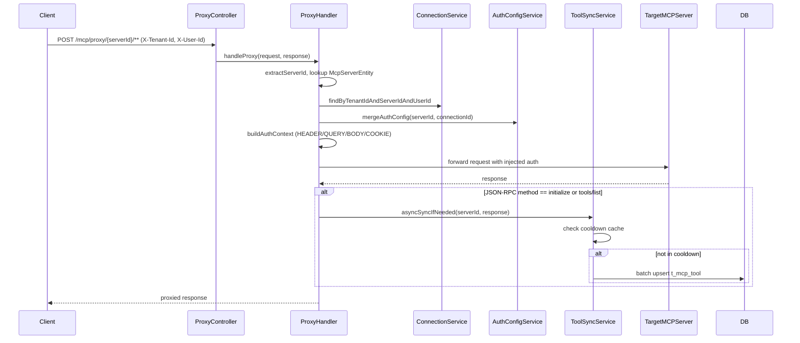
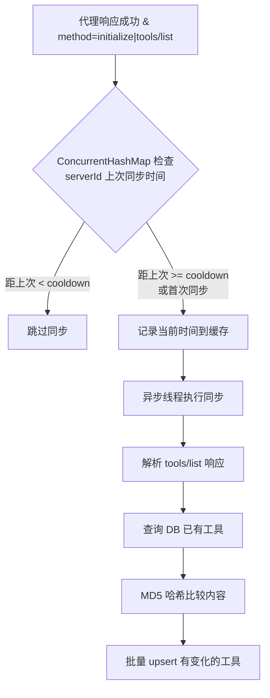

# MCP Server 代理接口实现

## 核心架构



代理的核心流程：

1. 用户请求 `/mcp/proxy/{serverId}/**`，通过 `X-Tenant-Id` + `X-User-Id` 请求头识别用户
2. 根据 `serverId` 查询 `McpServerEntity` 获取目标 endpoint
3. 根据 `tenantId + serverId + userId` 查询用户连接（`t_mcp_tenant_server_connection`）
4. 通过 `mergeAuthConfig(serverId, connectionId)` 合并系统配置和用户凭证
5. 根据 `t_mcp_auth_param_config` 的 `location`/`locationName` 将认证参数注入到 HEADER/QUERY/BODY/COOKIE
6. 转发请求到目标 MCP Server，返回响应给客户端
7. **如果是 `initialize` 或 `tools/list` 请求且成功**，异步触发工具同步（带防重复机制）

## Tool 同步策略（防止每次连接都同步）



**防重复同步机制**（在 `McpToolSyncService` 中实现）：

| 策略 | 说明 |

|------|------|

| **冷却时间** | 每个 serverId 维护一个 `lastSyncTime`（`ConcurrentHashMap<String, Instant>`），同步完成后记录时间，冷却期内（默认 5 分钟）跳过同步 |

| **serverId 级锁** | 同一 serverId 的同步请求串行执行，防止并发重复写入 |

| **内容哈希比较** | 用 MD5 比较工具的 description + parameters，只更新有变化的工具 |

| **仅触发条件** | 只有 `initialize` 和 `tools/list` 两种 JSON-RPC method 触发同步，普通的 `tools/call` 等不触发 |

## 实现步骤

### 1. 新建 RestClient 配置

新建 [`McpProxyConfig.java`](src/main/java/com/abc/mcp/config/McpProxyConfig.java)：

- 配置 `RestClient` Bean，设置连接超时（5s）和读取超时（30s）
- 用于代理 HTTP 请求

### 2. 新建 McpToolSyncService

新建 [`McpToolSyncService.java`](src/main/java/com/abc/mcp/service/McpToolSyncService.java)：

```java
// 核心字段
private final ConcurrentHashMap<String, Instant> lastSyncTimeMap; // serverId -> lastSyncTime
private final ConcurrentHashMap<String, Object> syncLocks;        // serverId -> lock object
private final ExecutorService asyncExecutor;                       // 异步线程池(5)
private static final Duration SYNC_COOLDOWN = Duration.ofMinutes(5);
```

核心方法：

- `asyncSyncIfNeeded(String serverId, String tenantId, byte[] responseBody, String method)` -- 检查冷却时间，满足条件则异步执行同步
- `syncToolsFromResponse(String serverId, String tenantId, byte[] responseBody)` -- 解析响应中的工具列表并同步到 DB
- `syncToolsToDatabase(String serverId, String tenantId, List<ToolData> tools)` -- 批量同步到 `t_mcp_tool` 表
  - 查询已有工具 `McpToolRepository.findByServerId(serverId)`
  - MD5 哈希比较，分为新增/更新/不变
  - 批量 `saveAll()`
- `parseToolsFromJsonRpcResponse(byte[] responseBody)` -- 从 JSON-RPC 响应中解析工具列表（兼容 SSE `data:` 格式）
- `clearSyncCache(String serverId)` -- 手动清除某个 server 的同步缓存（供管理接口调用）
- `clearAllSyncCache()` -- 清除所有缓存

### 3. 扩展 McpToolRepository

在 [`McpToolRepository`](src/main/java/com/abc/mcp/repository/McpToolRepository.java) 中增加：

- `List<McpToolEntity> findByServerId(String serverId)` -- 按 serverId 查询工具
- `void deleteByServerId(String serverId)` -- 按 serverId 删除工具

### 4. 新建 McpProxyHandler

新建 [`McpProxyHandler.java`](src/main/java/com/abc/mcp/handler/McpProxyHandler.java)，参考 alphabitcore 的实现但适配 abc-mcp-gateway 的分表认证体系：

核心方法：

- `handleProxy(request, response)` -- 普通 HTTP 代理
- `handleStreamingProxy(request, response)` -- SSE 流式代理
- 内部 `AuthContext` 类，基于 `t_mcp_auth_param_config` 的 `location` 字段（HEADER/QUERY/BODY/COOKIE）构建认证上下文
- `buildAuthContext(serverId, connectionId)` -- 从分表中读取参数定义 + 合并配置值，按 `location` 和 `locationName` 分类注入
- `buildTargetUrl(server, request)` -- 拼接目标 URL
- 请求头复制和过滤（排除 host/content-length/connection 等）
- 响应复制（状态码 + 响应头 + 响应体）
- **集成 tool 同步**：代理成功后，检查 JSON-RPC method，调用 `McpToolSyncService.asyncSyncIfNeeded()`

关键差异（vs alphabitcore）：

- 认证信息从 `McpConnectionAuthConfigService.mergeAuthConfig()` + `McpAuthParamConfigService` 获取（分表驱动）
- 参数注入位置由 `t_mcp_auth_param_config.location` 字段驱动（HEADER/QUERY/BODY/COOKIE），而非硬编码 switch-case
- Tool 同步委托给独立的 `McpToolSyncService`，带冷却时间防重复

### 5. 扩展 Repository 查询方法

在 [`McpTenantServerConnectionRepository`](src/main/java/com/abc/mcp/repository/McpTenantServerConnectionRepository.java) 中确认已有：

- `findByTenantIdAndServerIdAndUserId(tenantId, serverId, userId)` -- 代理时查询用户连接

### 6. 新建 McpProxyController

新建 [`McpProxyController.java`](src/main/java/com/abc/mcp/controller/McpProxyController.java)：

| 方法 | 路径 | 说明 |

|------|------|------|

| `ANY` | `/mcp/proxy/{serverId}/**` | 代理所有 HTTP 方法到指定 MCP Server |

| `ANY` | `/mcp/proxy/sse/{serverId}/**` | SSE 流式代理 |

| `GET` | `/mcp/proxy/servers` | 获取当前用户已连接的所有可代理 MCP Server 列表 |

| `GET` | `/mcp/proxy/health` | 代理服务健康检查 |

| `POST` | `/mcp/proxy/{serverId}/sync-tools` | 手动触发工具同步（清除冷却缓存后立即同步） |

### 7. 新建用户已连接服务器列表 DTO

新建 `ProxyServerInfoResponse.java`：包含 serverId、serverName、endpoint、authType、connectionStatus 等信息。

---

## 代码质量优化

在实现代理功能的同时，修复以下已发现的代码质量问题：

### 问题 1：McpServerServiceImpl.toResponse() 存在严重的 N+1 查询

**文件**: [`McpServerServiceImpl.java`](src/main/java/com/abc/mcp/service/impl/McpServerServiceImpl.java) 第 258-272 行

**问题**:

- `toolRepository.findByStatus("active")` 每次调用都查全表再内存过滤 -- 在分页列表中 N 条记录就触发 N 次全表扫描
- `categoryService.findAll()` 同理，每次调用都查全部分类再内存过滤

**修复方案**:

- 使用新增的 `McpToolRepository.findByServerId(serverId)` 替代全表查询 + 内存过滤
- 将 `categoryService.findAll()` 改为按 `categoryIds` 批量查询（如 `findAllById(categoryIds)`）
```java
// Before (N+1):
List<McpToolEntity> tools = toolRepository.findByStatus("active").stream()
        .filter(t -> t.getServerId().equals(server.getId()))
        .collect(Collectors.toList());

// After:
List<McpToolEntity> tools = toolRepository.findByServerId(server.getId());
```


### 问题 2：SuperEntity 已有 @PrePersist/@PreUpdate，手动设置 createdAt/updatedAt 冗余

**文件**: 多个 Service 实现类

**问题**:

`SuperEntity` 已经在 `@PrePersist` 中自动设置 `id`、`createdAt`、`updatedAt`，在 `@PreUpdate` 中自动设置 `updatedAt`。但多个 Service 中仍然手动设置这些字段：

- `McpServerServiceImpl.createServer()` 第 68-69 行: 手动设置 `createdAt`/`updatedAt`
- `McpServerServiceImpl.updateServer()` 第 115 行: 手动设置 `updatedAt`
- `McpAuthParamConfigServiceImpl.saveServerParamConfigs()` 第 114-115 行: 手动设置
- `McpConnectionAuthConfigServiceImpl.saveUserAuthConfig()` 第 50 行: 手动设置
- `McpTenantServerConnectionServiceImpl.createConnection()` 第 42-46 行: 手动设置

**修复方案**:

移除所有手动设置 `createdAt`/`updatedAt`/`id` 的代码，完全依赖 `SuperEntity` 的 JPA 生命周期回调。这样减少重复代码，且避免时间戳不一致的风险。

### 问题 3：McpSyncService.syncTools() 不做去重，每次全量新增

**文件**: [`McpSyncService.java`](src/main/java/com/abc/mcp/service/McpSyncService.java) 第 33-95 行

**问题**:

`syncTools()` 方法每次调用都直接 `toolRepository.save(entity)` 创建新记录，不检查是否已存在同名工具。多次同步会导致 `t_mcp_tool` 表中出现大量重复记录。

**修复方案**:

- 同步前先查询 `findByServerId(serverId)` 获取已有工具
- 按 name 做 Map，对比后分为新增/更新/不变
- 复用 `McpToolSyncService.syncToolsToDatabase()` 的同步逻辑

### 问题 4：McpAuthParamConfigServiceImpl.initDefaultTemplates() 中的 indexOf 在 List.of() 上低效

**文件**: [`McpAuthParamConfigServiceImpl.java`](src/main/java/com/abc/mcp/service/impl/McpAuthParamConfigServiceImpl.java) 第 276 行

**问题**:

```java
.sortOrder(builtinTemplates.indexOf(builtin))
```

`List.of()` 的 `indexOf()` 是 O(n) 线性扫描。虽然列表很小（5 项），但语义上应该使用循环索引。

**修复方案**:

改为 `for (int i = 0; i < builtinTemplates.size(); i++)` 循环，用 `i` 作为 `sortOrder`。

### 问题 5：McpConnectionAuthConfigServiceImpl.saveUserAuthConfig() 逐条保存

**文件**: [`McpConnectionAuthConfigServiceImpl.java`](src/main/java/com/abc/mcp/service/impl/McpConnectionAuthConfigServiceImpl.java) 第 51-68 行

**问题**:

循环内逐条调用 `connectionAuthConfigRepository.save(entity)`，产生 N 次 SQL INSERT/UPDATE。

**修复方案**:

收集所有需要保存的实体到 List，最后调用 `saveAll(entities)` 批量保存。

### 8. 更新 plan 文件

在 [`mcp_server_认证管理系统_implementation.plan.md`](.cursor/plans/mcp_server_认证管理系统_implementation.plan.md) 中增加阶段10。